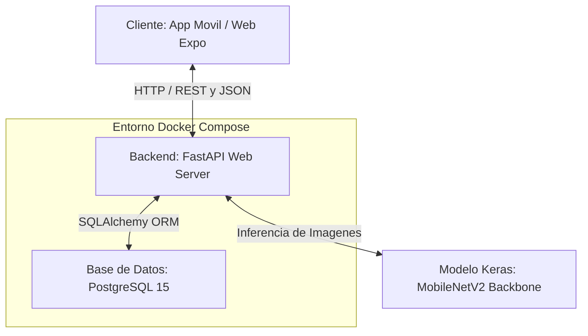

# Documento Técnico - Arquitectura del Sistema de Clasificación Inteligente CornGuard AI

Este documento detalla la arquitectura de software, el diseño de infraestructura y la pila tecnológica empleada en el desarrollo de **CornGuard AI**, una plataforma full-stack diseñada para la clasificación inteligente de enfermedades del maíz y el control automatizado de tratamientos foliares. Este documento sirve como marco de referencia teórico y práctico para investigaciones científicas en agrotecnología y agricultura de precisión.

---

## 🏛️ 1. Arquitectura General del Sistema

El sistema implementa una **Arquitectura de Microservicios Desacoplada** organizada en tres capas primarias coordinadas mediante contenedores Docker:

### Capas del Sistema:
1. **Capa de Presentación (Frontend)**: Interfaz responsiva interactiva construida en Expo y React Native, compilable para Android, iOS y Web.
2. **Capa de Lógica de Negocio (Backend)**: Microservicio REST de alto rendimiento en FastAPI para gestionar la autenticación, inferencia por aprendizaje profundo y la gestión del conocimiento fitopatológico.
3. **Capa de Persistencia (Base de Datos)**: PostgreSQL para el almacenamiento seguro de credenciales cifradas y literatura de diagnóstico fitosanitario.

---

## 💻 2. Pila Tecnológica (Tech Stack) y Justificación Científica

### Backend
- **FastAPI (v0.110.1)**: Elegido por su velocidad (comparable a NodeJS y Go) basada en **Starlette** y **Pydantic**. Su soporte nativo para programación asíncrona (`async/await`) permite manejar múltiples peticiones concurrentes de inferencia de imágenes sin bloquear la cola de ejecución. Genera automáticamente esquemas de OpenAPI (Swagger).
- **SQLAlchemy (v2.0.29)**: El ORM estándar de la industria en Python, utilizado para abstraer las transacciones de base de datos a objetos y garantizar una sintaxis modular y limpia, compatible con múltiples motores relacionales.
- **Alembic (v1.13.1)**: Herramienta de control de versiones y migraciones incrementales para la base de datos, garantizando la trazabilidad y la replicabilidad del esquema en entornos de staging y producción.
- **PostgreSQL (v15-Alpine)**: Gestor de bases de datos relacionales robusto y con soporte nativo de transacciones ACID, seleccionado para garantizar la fiabilidad del conocimiento fitosanitario en producción.

### Procesamiento Científico e Inferencia de IA
- **TensorFlow CPU (v2.16.1)**: La versión optimizada para CPU de TensorFlow permite cargar y consultar el archivo `.keras` del modelo sin requerir hardware dedicado (GPUs de Nvidia) ni controladores CUDA pesados. Esto abarata radicalmente los costos de despliegue en la nube (ej. AWS EC2 t3.medium o DigitalOcean droplets).
- **NumPy (v1.26.4)**: Para la manipulación de vectores numéricos y arrays multidimensionales de alta velocidad al preparar las matrices de píxeles antes del proceso de clasificación.
- **Pillow (v10.3.0)**: Biblioteca de procesamiento de imágenes para realizar el preprocesamiento geométrico y de canales en la RAM de forma eficiente.

### Seguridad y Autenticación
- **Passlib con Bcrypt (v1.7.4)**: Para el hashing criptográfico de contraseñas mediante la función de derivación de claves basada en Bcrypt. Esto previene ataques de fuerza bruta o de diccionario en caso de filtración de bases de datos.
- **Python-Jose (v3.3.0)**: Para la generación y validación de tokens web firmados criptográficamente (JSON Web Tokens - JWT) que viajan de forma segura en las cabeceras HTTP para autenticar al administrador.

### Frontend (Expo React Native)
- **Expo (v56.0.4)**: Framework de código abierto sobre React Native que acelera el desarrollo móvil al proporcionar una base multiplataforma y una API unificada. Permite compilar a web nativa y generar de forma sencilla el archivo **APK** compilado para Android.
- **Expo Image Picker (v15)**: API multiplataforma para interactuar de forma segura y consistente con la cámara del dispositivo y los álbumes de fotos.

---

## 🧠 3. Proceso Científico de Inferencia Fitopatológica

El modelo de clasificación `mejor_modelo_maiz_V3_38.keras` está basado en la arquitectura **MobileNetV2**, una red neuronal convolucional profunda optimizada para dispositivos móviles y cómputo de recursos limitados.

### Flujo de Trabajo del Procesamiento de Imágenes:

### Preprocesamiento y Ajuste Matricial:
1. **Decodificación**: Los bytes crudos de la imagen (JPEG o PNG) se decodifican y se convierten forzosamente al espacio de color de tres canales **RGB**. Las imágenes con canales alfa (transparencia PNG) se normalizan a 3 canales.
2. **Interpolación Bilineal**: La imagen se redimensiona a $224 \times 224$ píxeles mediante una interpolación bilineal para preservar los bordes y las texturas sintomáticas de las lesiones foliares.
3. **Conversión a Vector**: Los datos se cargan en un array de punto flotante de 32 bits (`float32`).
4. **Batch Dimension**: Se agrega un eje extra en el index `0` mediante `np.expand_dims(img_array, axis=0)`, transformando el tensor de entrada de dimensiones $(224, 224, 3)$ a $(1, 224, 224, 3)$. Esto simula un "lote" de una sola imagen exigido por Keras.
5. **Inferencia y Softmax**: La función `.predict()` de Keras evalúa la matriz y retorna una matriz probabilística de tamaño $(1, 3)$. Aplicando la operación matemática `argmax` ($Index = \arg\max(P)$), identificamos el índice con mayor peso numérico para asignar la etiqueta final y determinar el porcentaje de certeza diagnóstica.

---

## 🔒 4. Arquitectura de Seguridad (JWT y Autenticación Criptográfica)

El sistema protege las operaciones críticas de actualización utilizando autenticación sin estado (stateless) mediante JWT (JSON Web Tokens):

1. **Hashing de Contraseñas**: Las contraseñas nunca se guardan en texto plano en la tabla `users`. Al sembrarse la base de datos o crearse un usuario, se aplica **Bcrypt** con un número de "rounds" dinámico (trabajo de cómputo) que encripta la clave mediante un valor de sal (salt) único.
2. **Generación de Token**: Al iniciar sesión mediante `/api/auth/login`, el backend verifica la coincidencia del hash. Si es exitoso, genera un token firmado utilizando la clave simétrica privada `JWT_SECRET` y el algoritmo criptográfico **HS256**. El token codifica un payload con la expiración y la identidad del admin.
3. **Middleware de Protección (Inyección de Dependencias)**: El endpoint `PUT /api/classes/{class_name}` utiliza la inyección de dependencia `get_current_user` de FastAPI. Este intercepta la cabecera `Authorization: Bearer <token>`, decodifica la firma y autoriza la actualización únicamente si el token es válido y no ha expirado.

---

## 🐳 5. Infraestructura y Despliegue en Contenedores (Docker)

El entorno modular se compone de dos contenedores orquestados mediante `docker-compose.yml`:

1. **Contenedor `db` (PostgreSQL)**:
   - Basado en una imagen ultraligera Alpine de Linux.
   - Declara un volumen de datos con persistencia local (`postgres_data`) para asegurar que las modificaciones de literatura agrícola sigan vigentes aunque los contenedores se detengan o reinicien.
2. **Contenedor `backend` (FastAPI + Keras)**:
   - Basado en la imagen oficial de Python-slim para reducir la superficie de ataque y el tamaño final de la imagen.
   - Integra la biblioteca de compilación C `libpq-dev` y herramientas de desarrollo para asegurar el correcto acoplamiento del adaptador nativo de PostgreSQL (`psycopg2`).
   - El script `entrypoint.sh` implementa un bucle de bloqueo activo que realiza sondeos de red al puerto `5432` del contenedor de base de datos antes de gatillar Alembic y Uvicorn, previniendo errores de conexión durante el encendido concurrente.
